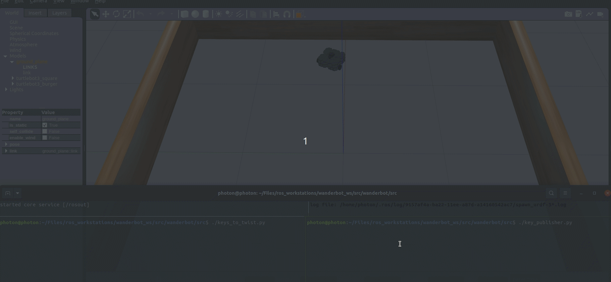

# ROS-Terminal-Keyboard-Input
Program to capture the keys from keyboard and publish the keys to nodes to control other nodes.

`key_publisher.py` takes the keystokes and publishes topic specified in it.

Make a bridge program that subscribes to the topic published by `key_publisher.py`, which is `'keys'` and publish the appropriate data based on the input provided. Here, `keys_to_twist.py` listens to the input published by `key_publisher.py`, and publishes `Twist` data based on the keys it received to Gazebo topic `cmd_vel`. This way you can control the robot. 

